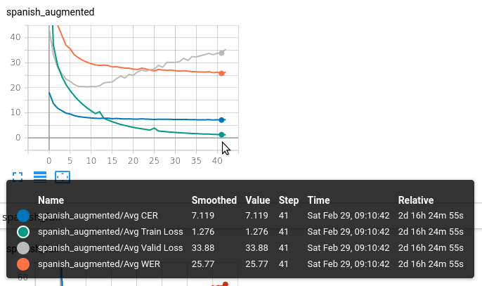

### spanish datasets
* [Heroico&USMA](https://www.openslr.org/39/)
* [m-ailabs, catio](https://www.caito.de/2019/01/the-m-ailabs-speech-dataset/): es_ES 	108h 34m
* [colombian-spanish](https://www.openslr.org/72/): 2.5GB
* [peruvian-spanish](https://www.openslr.org/73/)
* [puerto-rico-spanish](https://www.openslr.org/74/)
* [venezuelan-spanish](https://www.openslr.org/75/): 1.6GB
* [argentinian-spanish](https://www.openslr.org/61/): not yet using it

### results

* still don't know why validation-loss rises but avg-WER keeps falling
#### 40 epochs
| prediction | target
| --- | ---
| trabajas en la industrial do cine. | ¿trabajas en la industria del cine?
| algunas frases están mal hechas. | algunas frases están mal hechas.
| no harias nada? | ¿ no harías nada?
| pero nunca llegó a su destino. | pero nunca llegó a su destino.
| vale , esta claro. | vale. ¿ esta claro?
| sin solidaiydad no somos plada. | sin solidaridad no somos nada.
| jue alcalde del municipio tobal. | fue alcalde del municipio tovar.
| allos ta sos rontos los pagar a aren anterc omenod. | los platos rotos los pagará tu madre.
#### 2 epochs
| prediction | target
| --- | ---
| trabajas emendo ste dencinen? | ¿trabajas en la industria del cine?
| al una fracesetan malechas. | algunas frases están mal hechas.
| no arías nada? | ¿ no harías nada?
| pero nunca llegóa su destino. | pero nunca llegó a su destino.
| vale, estaclano? | vale. ¿ esta claro?
| sin sulida ydad enos o mostlada. | sin solidaridad no somos nada.
| fug alcalde del monecicio tobarto. | fue alcalde del municipio tovar.
| epopuslotos los pagarapara de gomen. | los platos rotos los pagará tu madre.

### libraries for feature-extraction 
[wav2vec](https://github.com/pytorch/fairseq/tree/master/examples/wav2vec)

### libraries for speech recognition
#### [Pytorch-Kaldi](https://github.com/mravanelli/pytorch-kaldi)
* seems to be __too complicated__ -> __not worth the pain!__ +will soon be outdated, successor: [SpeechBrain](https://speechbrain.github.io/)
* paper: `THE PYTORCH-KALDI SPEECH RECOGNITION TOOLKIT`

* acoustic features: 
    
        i.e., 39 MFCCs (13 static+∆+∆∆), 
        40 log-mel filter-bank features (FBANKS), as well as 40 fMLLR features [25] 
        (extracted as reported in the s5 recipe of Kaldi),
         that were computed using windows of 25 ms with an overlap of 10 ms.
* differences to [ESPnet](https://github.com/espnet/espnet):
    
        ESPnet is an end-to-end speech processing toolkit, mainly focuses on end-to-end speech recognition
         and end-to-end text-to-speech. The main difference with our project is the current version of 
         PyTorchKaldi implements hybrid DNN-HMM speech recognizers

#### [ESPnet](https://github.com/espnet/espnet)
* seems overcomplicated + obfuscated
* stupid stages! make data augmentation impossible!

#### [facebook wav2letter++](https://github.com/facebookresearch/wav2letter) did not succeed to properly compile it

#### mozilla [DeepSpeech](https://github.com/mozilla/DeepSpeech) seems NOT to be working properly! [see](https://discourse.mozilla.org/t/terrible-accuracy/46823/32)

#### [deepspeech.pytorch](https://github.com/SeanNaren/deepspeech.pytorch)
  * got it running with singularity on cluster
  * might be outdated, used RNNs!
  
#### fairseq has a pure pytorch implementation based on `vggtransformer`
  * runs like forever?
  
#### [espresso](https://github.com/freewym/espresso)
  + seems to be stolen from espnet!
 
 
#### [open-nmt](https://github.com/OpenNMT/OpenNMT-py)

# datasets
* [m-ailabs-speech-dataset](https://www.caito.de/2019/01/the-m-ailabs-speech-dataset/)
* [common-voice](https://voice.mozilla.org/en/datasets)

# TODO

* train wav2vec on spanish, use it in combination with deepspeech.pytorch
* evaluate frequency-domain data augmentation